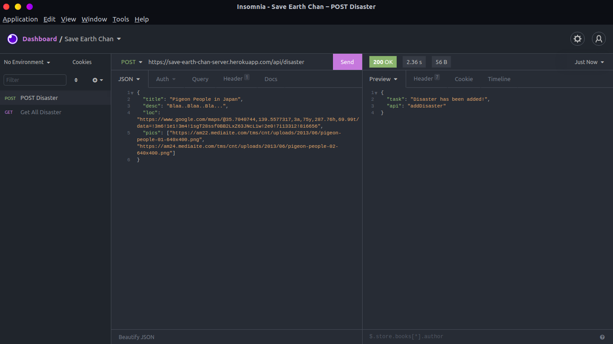
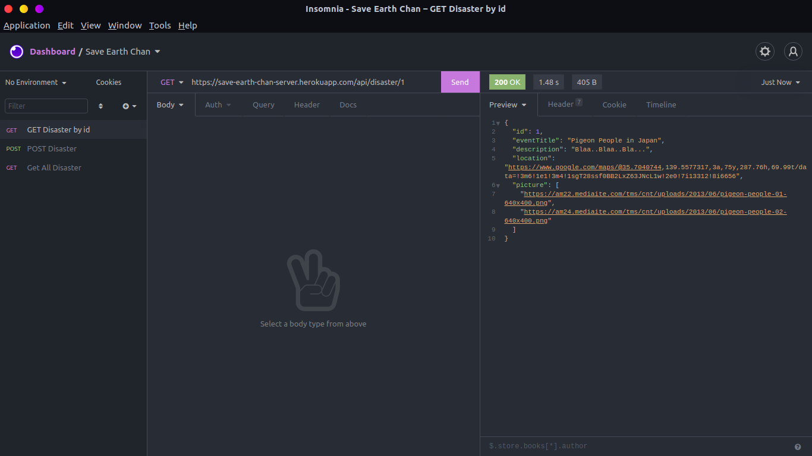

<h1 align="center">Earth-chan</h1>

<h2 align="center"><a href="https://save-earth-chan-server.herokuapp.com">Root API</a></h2>

# POST Disaster Data
## [POST /api/disaster](https://save-earth-chan-server.herokuapp.com/api/disaster)
  Example:

# GET All Disaster Data
## [GET /api/disaster](https://save-earth-chan-server.herokuapp.com/api/disaster)

  Example:

# GET Disaster by id
## [GET /api/disaster/{id}](https://save-earth-chan-server.herokuapp.com/api/disaster/1)
  Example:

# GET DISASTER by Query 
## [/api/disaster/search](https://save-earth-chan-server.herokuapp.com/api/disaster)

# Additional Parameters
| Parameters       | Details                  |
-------------------|---------------------------
| ``perPage``      | (int) Max item per page  |
| ``page``         | (int) nth Page           |
| ``query``        | (string) query field     |