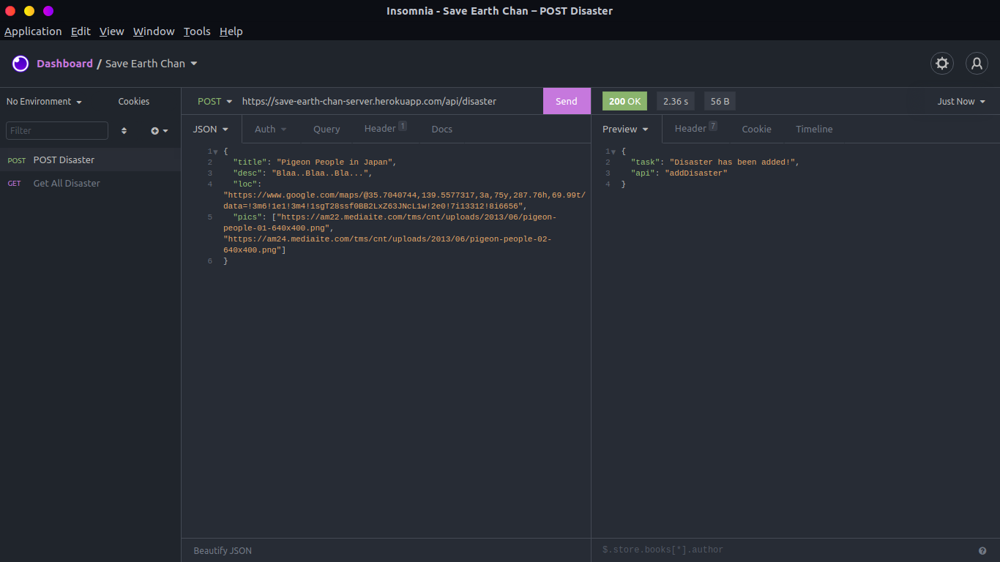
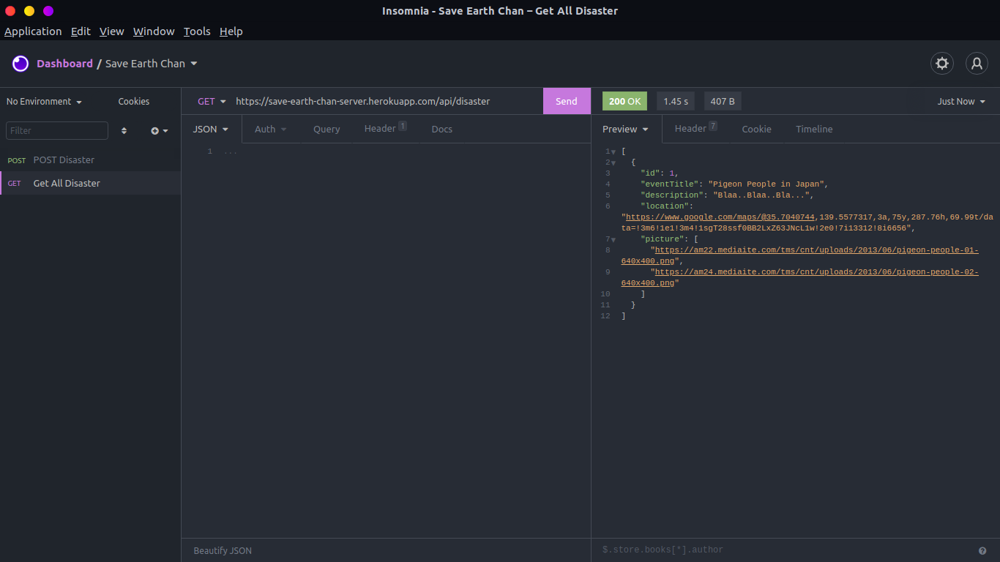
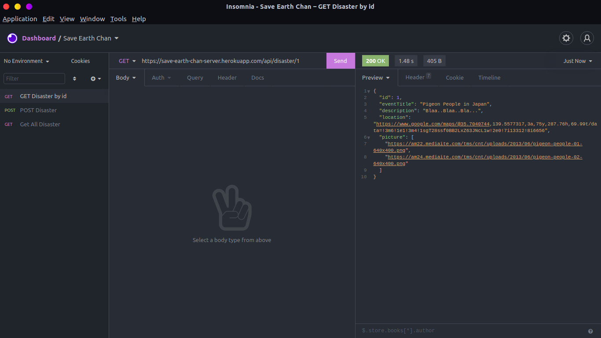

# Earth-Chan Need your help :'(

Root API url: https://save-earth-chan-server.herokuapp.com

# POST Disaster Data
url: https://save-earth-chan-server.herokuapp.com/api/disaster
Example:

# GET All Disaster Data
url: https://save-earth-chan-server.herokuapp.com/api/disaster
Example:

# GET Disaster by id
url: https://save-earth-chan-server.herokuapp.com/api/disaster/<id>
Example:
